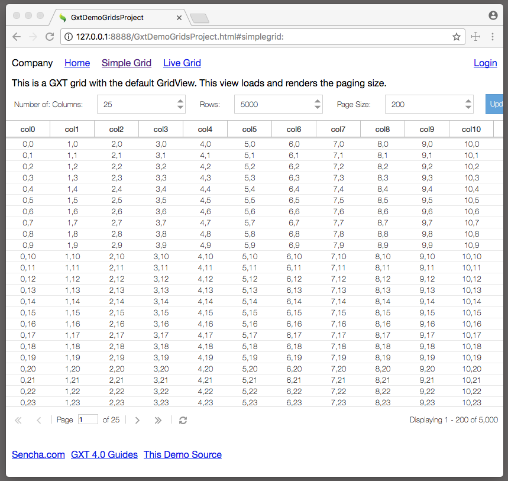

# GXT Demo Grids.
Show how to wire up the grids. And it allows some experimentation of sizes of simulated record sets. 

## GXT 

* [Sencha GXT Product Info](https://www.sencha.com/products/gxt/)
* [GXT Guides](http://docs.sencha.com/gxt/4.x/)

## Demo

* [Grids Demo](http://examples.sencha.com/gxt-grids/)

## Debug
1. Run `mvn install` at root, so the theme is built. (You can stop it on the application compile, debugging in SDM will do this piece)
2. Import the project into the IDE. 
3. Start the launcher in the ide. 
4. Debug the application, from the application module.

* `mvn install` only has to be done initially to set up the project. 
* Or run `mvn install` on the theme if it's modified. 
